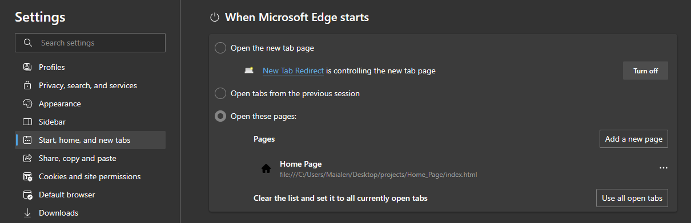
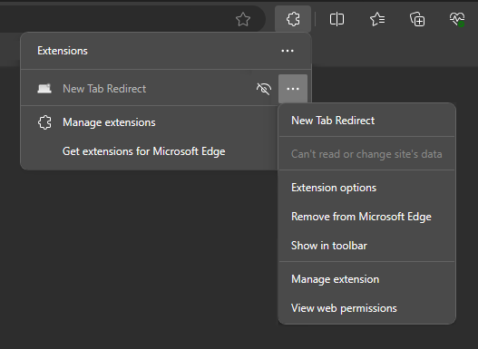
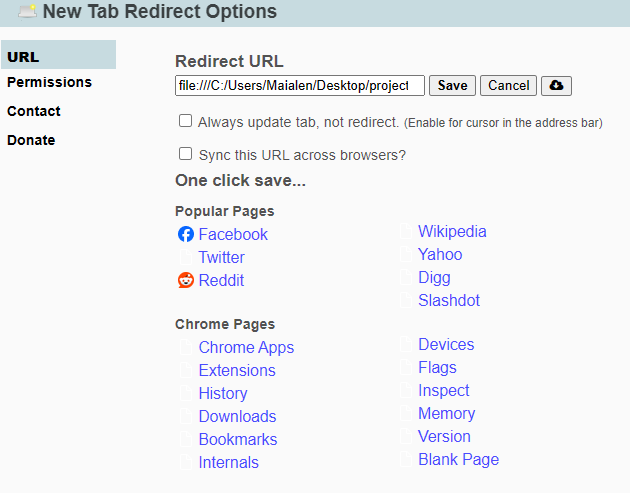
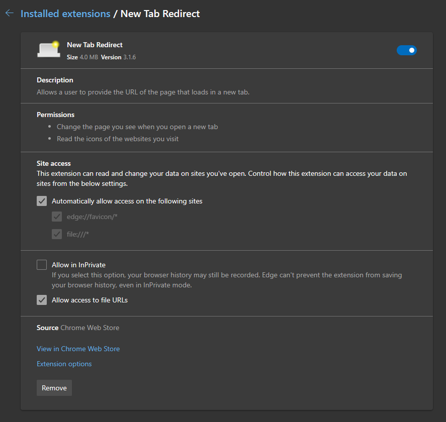
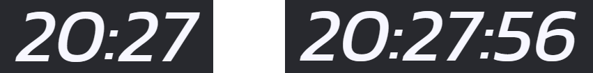

# Home Page

This React project aims to create a customizable startpage that can be used in web browsers. It serves as the landing page when users open a new tab in their browser and/or as start page. Home Page provides a visually appealing and functional interface that can be personalized to suit the user's preferences. It is created with scalability in mind , which enables startpage to be used on differend devices with various resolutions and shapes.

## Setup

### Start Page

1. In Settings of your browser go to **Start, home, and new tab**.
2. In **When Microsoft Edge starts** select **Open these pages:**
3. Click **Add new page** and paste absolute path to index.html` file with yout Home Page.

<!--  -->

### New Tab
1. Install extenction [New Tab Redirect](https://chromewebstore.google.com/detail/icpgjfneehieebagbmdbhnlpiopdcmna)

1. In **Extension Options** paste url to `index.html` in **Redirect URL**. Remember to add `file:///` or copy link from previous stage.

1. In **Manage extension** page change settings to allow access to file URLs.

## Configuration
In `config.js` you can change used images, links, and names of all buttons and lists.
When `isTimeWithSeconds` variable is changes to `true` seconds will be ncluced in shown time.

By changing `username` you can change greeting.

## Used icons
github-mark.png - https://github.com/logos
From flaticon:
linkedin.png - riajulislam
home.png - Freepik
brightness-and-contrast-dark.png - zafdesign
brightness-and-contrast-light.png - brightness-and-contrast-dark.png by zafdesign with contrast
keyboard.png - Sebastian Belalcazar