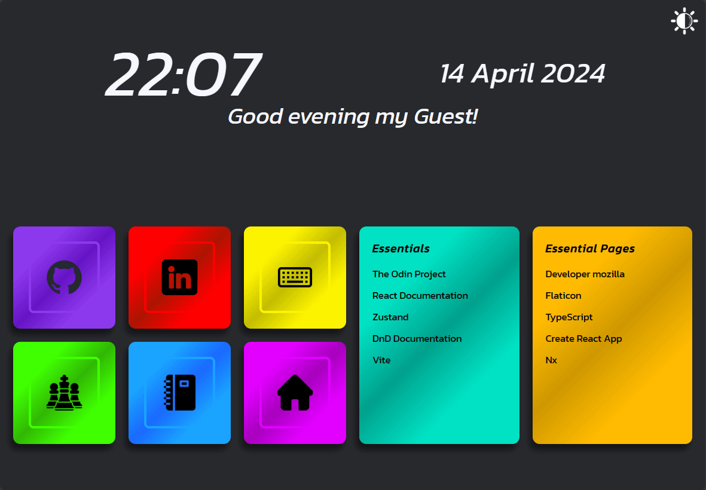
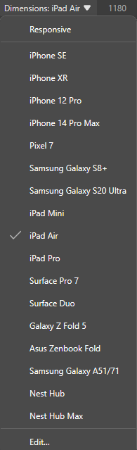
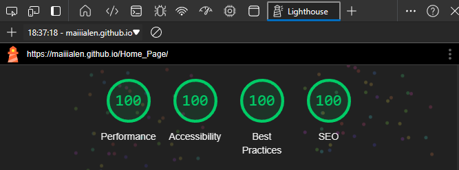
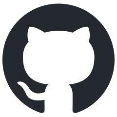

# Home Page

This React project aims to create a customizable startpage that can be used in web browsers. It serves as the landing page when users open a new tab in their browser and/or as a start page. Home Page provides a visually appealing and functional interface that can be personalized to suit the user's preferences. It is created with scalability in mind, which enables startpage to be used on different devices with various resolutions and shapes. The page has light and dark modes.

---

### Setup Start Page

1. In Settings of your browser go to **Start, home, and new tab**.
2. In **When Microsoft Edge starts** select **Open these pages:**
3. Click **Add new page** and paste the absolute path to the `index.html` file with your Home Page.

---

### Setup New Tab

1. Install extension [New Tab Redirect](https://chromewebstore.google.com/detail/icpgjfneehieebagbmdbhnlpiopdcmna)
   

2. In **Extension Options** paste url to `index.html` in **Redirect URL**. Remember to add `file:///` or copy the link from the previous stage.
   

3. In the **Manage extension** page change settings to allow access to file URLs.
   

---

## Configuration

In `config.js` you can change used images, links, and names of all buttons and lists as well as the colors of all boxes and lists.

By changing the `isTimeWithSeconds` variable to `true`, the displayed clock will include seconds.

By changing the username, hours of periods, and greeting contents you can change the displayed greeting.

You can customize the page's title and image by editing the index.html file.

Additionally, the page can be rendered in either *scalability mode* or *desktop mode*, depending on which styles are uncommented in the `index.html` file.
- In *scalability mode*, the layout dynamically adjusts to fit different window resolutions, with components resizing and repositioning to optimize the viewing experience. This can be checked in dev tools by changing emulated device.

- In *desktop mode*, the page is tailored for larger screens and landscape orientations, offering an ideal layout for desktop and widescreen displays. This mode ensures the best visual quality, providing a **perfect score** in terms of design and performance which can be confirmed in Lighthouse dev tool.

---

### Used font
Font used in project: [Kanit](https://fonts.google.com/specimen/Kanit)

### Used icons

|                             image                              | source                                                                                          |
| :------------------------------------------------------------: | :---------------------------------------------------------------------------------------------- |
|                    | github-mark.png - https://github.com/logos                                                      |
|                       | linkedin.png - riajulislam                                                                      |
|                           | home.png - Freepik                                                                              |
|                       | notebook.png - Freepik                                                                          |
|   | brightness-and-contrast-dark.png - zafdesign                                                    |
|  | brightness-and-contrast-light.png - brightness-and-contrast-dark.png by zafdesign with contrast |
|                       | keyboard.png - Sebastian Belalcazar                                                             |
|                          | chess.png - bqlqn                                                                               |
